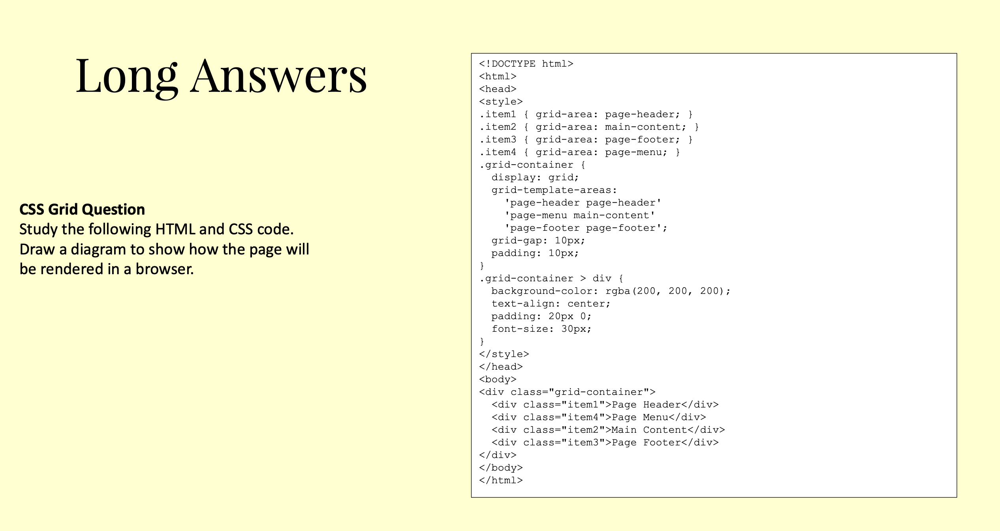

# INFO30005 Web Information Technologies Summary


## Some points
- Version: 2019 Semester 1
- Lecturer: [Eduardo Oliveira](https://www.eduoliveira.com/) and [Ronal Singh](https://cis.unimelb.edu.au/people/rr-singh)
- Full stack project based course
- Programming part has not been teached in detail, which means you need to find many other resources to learn full stack dev


## Week 1 Lecture 1 Introduction to the subject (Not Examinable)


## Week 1 Lecture 2 History of Web & Introduction to web development (Not Examinable)


## Week 2 Lecture 1 Basic Technologies - Git


## Week 2 Lecture 2 Basic Technologies - JavaScript


## Week 3 Node & Express


## Week 4 Lecture 1 API servers and REST


## Week 4 Lecture 2 MongoDB & Mongoose


## Week 5 Lecture 1 HTML & CSS


## Week 5 Lecture 2 Design Principle: Layout, Typography, Colour (Not Examinable)


## Week 6 Lecture 1 User Research Design Thinking (Not Examinable)


## Week 6 Lecture 2 Usability


## Week 7 Lecture 1 Responsive Design and Advanced JavaScript


## Week 7 Lecture 2 API Client ES6, Sass, Babel


## Week 8 Security and Risk (Security Principles, Risk assessment)


## Week 9 Lecture 1 Testing


## Week 9 Lecture 2 Exam Review
### **Type of Questions**
 8 - 10 Questions including: Multiple Choice, Short Answers, Long Answers
### **Some Example Questions**
#### **Multiple Choice Questions**
- Inside which HTML element do we put the JavaScript
	- <Script\>
- How to change the HTML element below using JavaScript?  `<p id="demo">This is just a demo for you</p> `
	- `Document.getElementById("demo").innerHTML = "Hello"`
#### **Short Answers Questions**
- List three git commands to a. Clone a repository b. Add a file to staging area c. Commit a file
	- a. git clone http://www.github.com/libgit2/libgit2.git
	- b. git add *.c
	- c. git commit -m "initialisation"
- What is XMLHttpRequest (XHR)
	- XMLHttpRequest(XHR) is an API in the form of object whose methods transfer data between a web browser and a web server
- State two reasons for testing your web-application
	- Error free. That is contain no (or at least possible number of) bugs
	- Predictable. We implement functionality to achieve certain tasks. We want to make sure that when we execute a functionality, the outcomes as we intended to be, not only the first time but always
	- Resilient to changes. That is be able to handle changes to functionality. Over the life of our web application, we will either enhance existing functionality or implement new ones. When we change a functionality, we can re-run all of our tests to ensure that other components (e.g. functions or classes) that may be dependent on the changed components continues to function as we intended
- Given the following HTML&CSS, what the colour of "Hello"
``` html
 <html>
	 <body class="red">
		 <h1 class="blue">
			 Hello
		 </h1>
	 </body>
 </html>
```
``` css
.blue {
	color: blue;
}
.red {
	color: red;
}
```

- Use the following incomplete tests to answer the two questions that follow. Write the missing assertion statement for testing the value of the variable *prod*, which is expected to be equal to *2.2*
``` javascript
var assert = require('assert');
describe('Mocha Test', function() {
	it('checking the product of two numbers', function() {
		var prod = 1.0 * 2.2;
		// Missing assertion
	});
	it('check the length of a string', function() {
		assert.strictEqual("mocha".length, 5);
	});
});
```
 `assert.strictEqual(prod, 2.2);`
 #### **Long Answers Questions**
- Question 1

- Question 1 Answer

- Question 2

- Question 2 Answer


## Week 10 Lecture 1 Expanding your Reach (SEO, Accessibility)


## Week 10 Lecture 2 Localisation & Internationalisation


## Week 11 Lecture 1 Future of The Web (Not Examinable)


## Week 11 Lecture 2 Web of things (Not Examinable)


## Week 12 Lecture 1 Project Showcase
- No New Content


## Week 12 Lecture 2 Review
- No New Content
