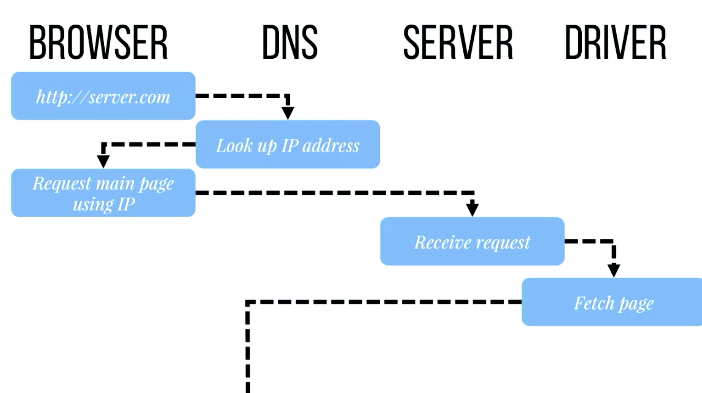
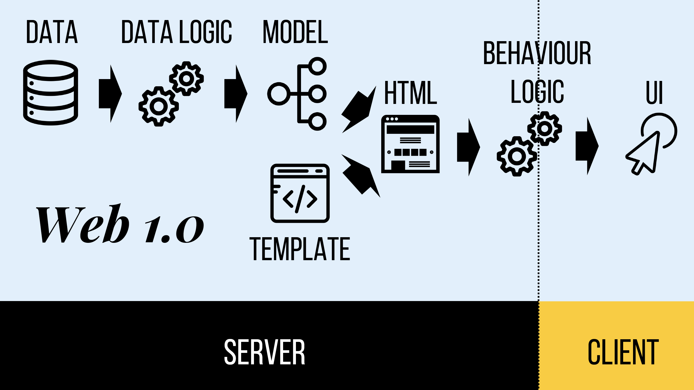
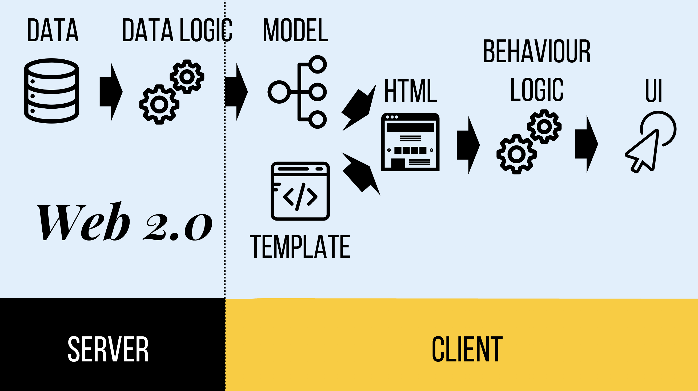

# INFO30005 Web Information Technologies Summary


## Overview
- Version: 2019 Semester 1
- Lecturer: [Eduardo Oliveira](https://www.eduoliveira.com/) and [Ronal Singh](https://cis.unimelb.edu.au/people/rr-singh)
- Full stack project based course
- Programming part has not been teached in detail, which means you need to find many other resources to learn full stack dev


## Week 1 Lecture 1 Introduction to the subject (Not Examinable)


## Week 1 Lecture 2 History of Web & Introduction to web development (Not Examinable)
- **History**
	- WWW: World Wide Web
	- URL: Uniform Resources Locator
	- HTML: HyperText Markup Language
	- HTTP: HyperText Transport Protocol
	- Type of Web Hosts
		- Self-Service
		- Co-Located
		- Dedicated
		- Virtual Private(VPS)
		- Cloud
		- Shared
		- Managed
	- ISP: Internet Service Provider
	- DNS: Domain Name Server
		- Request Recursive Name Server
		- Root Name Server
- **Web Dev**
	- Web 1.0 - Static Web
		- Content: Reading content, Personal Site, Content Ownership, Taxonomies
		- Tech: HTML, HTTP, Synchronous, Client-Server
	
	
	- Web 2.0 - Wisdom Site
		- Web apps that behave like native app
		- AJAX: Asynchronous JavaScript and XML
		- Content: Creating Content, Blogs & Profiles, User Content, Folksonomies
		- Tech: HTML, AJAX, HTTP, JSON, Asynchronous, Peer-to-Peer, REST, SOAP
		- Front-End
			- Web Design: Photoshop, Illustrator, Dreamweaver, XD
			- Front-End Dev: HTML, CSS, JavaScript, Angular
		- Back-End:
			- Application: PHP(cake), Ruby(Rails), JS(Node), Python(Django)
			- Server: Apache, IIS, GWS, Express
			- Database: MySQL, MongoDB, Oracle, S2Lite




## Week 2 Lecture 1 Basic Technologies - Git
- Why use version control
	- Compare Files
	- Identify Differences
	- Merge Changes
	- Revert to previous working code
	- Snapshot
- Commands
	- `git init`: creates the repo
	- `git clone`: clones a remote repo
	- `git status`: status of repo
	- `git add <file>`: add file to staging area
	- `git add -A`: add all to staging area
	- `git checkout -- <file>`: undo uncommitted changes
	- `git add *.<extension>`: add all with extension to staging area
	- `git commit -m "<message>"`: commit changes to repo
	- `git log`: show commit history
	- `git checkout <commit_id>`: move head to that commit
	- `git revert --no-commit <id>..HEAD`
	- `git commit` revert to that commit
	- `git diff` compares with last commit
- `pull` and `push`
	- `pull`: to synchronize all of changes in the server to my local machine
	- `push`: put all of the local changes to the server
- Branches
	- `git branch`: show branches
	- `git checkout -b <branch>`: create a new branch
	- `git merge <branch>`: merges with branch
	- `git branch -d <branch>`: delete branch
- Some advises
	1. Commit often
	2. Commit related changes together
	3. Commit completed work
	4. Branch before you build
	5. Commit with meaningful message
	6. Agree on a workflow
- Atlassian SourceTree
- .gitignore

## Week 2 Lecture 2 Basic Technologies - JavaScript


## Week 3 Node & Express
- What is **Node**?
	- Node.js is a JavaScript **runtime** built on Chrome's V8 JavaScript engine. Node.js uses an **event-driven**, **non-blocking I/O** model that makes it **lightweight** and **efficient**. Node.js package ecosystem, npm, is the largest ecosystem of open source libraries in the world
- What is Node good for?
	- I/O Bound Application
	- JSON APIs
	- Big Data
	- Single-Page Applications
- Advantages of Node
	- Npm
	- Use JavaScript
	- Great Libraries
	- High-performance
	- Open source
	- Great for apis
	- Asynchronous
	- Great Community
	- Great for realtime apps
	- Great for command line utilities
- Npm (Node Package Manager)
	- Package manager for JS
	- Public registry
	- Centralised
	- Accessible via the cmd
	- Easy to share code
	- `npm install <package>`
	- `var <varname> = require("package");`
	- `npm init`
	- answer questions
	- check *package.json*
- Modularising Your Code
``` js
module.export = {
	key : value
}
```
``` js
const library = require('./library.js');
let value = libirary.key;
```
- Core Packages
	- *fs*: file system
	- *net*: TCP client and servers
	- *http* and *https*: basic web server
	- *dns*: domain name resolution
	- *assert*: writing tests
	- *os*: querying the operating system
- Express
	- Streamlined Node
	- Server methods
	- Routing
	- Easy APIs
	- Middleware friendly
- First Express App
	- Create dir and app.js
	- Install express: `npm install express --save`
	- Require express
	- `var app = express();`
	- Create routes:
		- `/: print Hello World!`
		- `/bye: print Goodbye World!`
	- Listen on a port
``` js
const express = require('express');
const app = express();

app.get('/', function(req, res) {
	res.send("Hello World");
});

app.get('/bye', function(req, res) {
	res.send("Goodbye world");
});

app.listen(3000, function() {
	console.log('Express serving at port 3000');
});
```
- Routes
	- `/` Just the URL
	- `*` catch all
	- `/:pattern` catches URLs that match the pattern
		- e.g. `/post/:id`
		- `www.blog.com/post/123123` matches
		- `www.blog.com/123123` does not match
		- id can be retrieved: `req.params.id`
- Organising Node Project
	- package.json
	- public/
	- node_modules/
	- app.js
	- models/
	- views/
	- controllers/
	- routes/
	- middleware/
- Create controller/controller.js
``` js
const posts = require('../models/posts');

module.exports.fetchMainPage = function(req, res) {
	res.send("Welcome to my Blog!");
};

module.exports.fetchAllPosts = fucntion(req, res) {
	res.send(posts);
};

module.exports.fetchPost = function(req, res) {
	const post = posts[req.params.id];
	res.render('post_template', {post:post});
};
```
- Create routes/routes.js
``` js
const express = require('express');
const router = express.Router();
const controller = require('../controllers/controllers');

router.get('/', controller.fetchMainPage);
router.get('/posts', controllers.fetchAllPosts);
router.get('/posts/:id', controllers.fetchPost);
module.exports = router;
```


## Week 4 Lecture 1 API servers and REST


## Week 4 Lecture 2 MongoDB & Mongoose


## Week 5 Lecture 1 HTML & CSS


## Week 5 Lecture 2 Design Principle: Layout, Typography, Colour (Not Examinable)


## Week 6 Lecture 1 Design Thinking (Not Examinable)


## Week 6 Lecture 2 Usability


## Week 7 Lecture 1 Responsive Design and Advanced JavaScript (Advanced JavaScript Not Examinable)


## Week 7 Lecture 2 API Client ES6, Sass, Babel (Sass & Babel Not Examinable)


## Week 8 Security and Risk (Security Principles, Risk assessment)


## Week 9 Lecture 1 Testing


## Week 9 Lecture 2 First Exam Review
### **Type of Questions**
 8 - 10 Questions including: Multiple Choice, Short Answers, Long Answers
### **Some Example Questions**
#### **Multiple Choice Questions**
- Inside which HTML element do we put the JavaScript
	- <Script\>
- How to change the HTML element below using JavaScript?  `<p id="demo">This is just a demo for you</p> `
	- `Document.getElementById("demo").innerHTML = "Hello"`
#### **Short Answers Questions**
- List three git commands to a. Clone a repository b. Add a file to staging area c. Commit a file
	- a. git clone http://www.github.com/libgit2/libgit2.git
	- b. git add *.c
	- c. git commit -m "initialisation"
- What is XMLHttpRequest (XHR)
	- XMLHttpRequest(XHR) is an API in the form of object whose methods transfer data between a web browser and a web server
- State two reasons for testing your web-application
	- Error free. That is contain no (or at least possible number of) bugs
	- Predictable. We implement functionality to achieve certain tasks. We want to make sure that when we execute a functionality, the outcomes as we intended to be, not only the first time but always
	- Resilient to changes. That is be able to handle changes to functionality. Over the life of our web application, we will either enhance existing functionality or implement new ones. When we change a functionality, we can re-run all of our tests to ensure that other components (e.g. functions or classes) that may be dependent on the changed components continues to function as we intended
- Given the following HTML&CSS, what the colour of "Hello"
``` html
 <html>
	 <body class="red">
		 <h1 class="blue">
			 Hello
		 </h1>
	 </body>
 </html>
```
``` css
.blue {
	color: blue;
}
.red {
	color: red;
}
```

- Use the following incomplete tests to answer the two questions that follow. Write the missing assertion statement for testing the value of the variable *prod*, which is expected to be equal to *2.2*
``` javascript
var assert = require('assert');
describe('Mocha Test', function() {
	it('checking the product of two numbers', function() {
		var prod = 1.0 * 2.2;
		// Missing assertion
	});
	it('check the length of a string', function() {
		assert.strictEqual("mocha".length, 5);
	});
});
```
 `assert.strictEqual(prod, 2.2);`
 #### **Long Answers Questions**
- Question 1

- Question 1 Answer

- Question 2

- Question 2 Answer


## Week 10 Lecture 1 Expanding your Reach (SEO, Accessibility)


## Week 10 Lecture 2 Localisation & Internationalisation


## Week 11 Lecture 1 Future of The Web (Not Examinable)


## Week 11 Lecture 2 Web of things (Not Examinable)


## Week 12 Lecture 1 Project Showcase
- No New Content


## Week 12 Lecture 2 Second Exam Review
- Go over the sample exam paper
